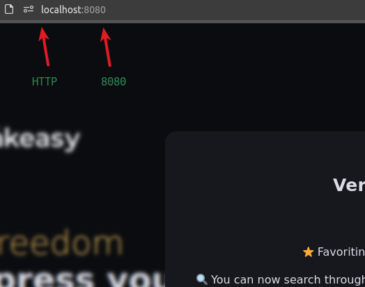
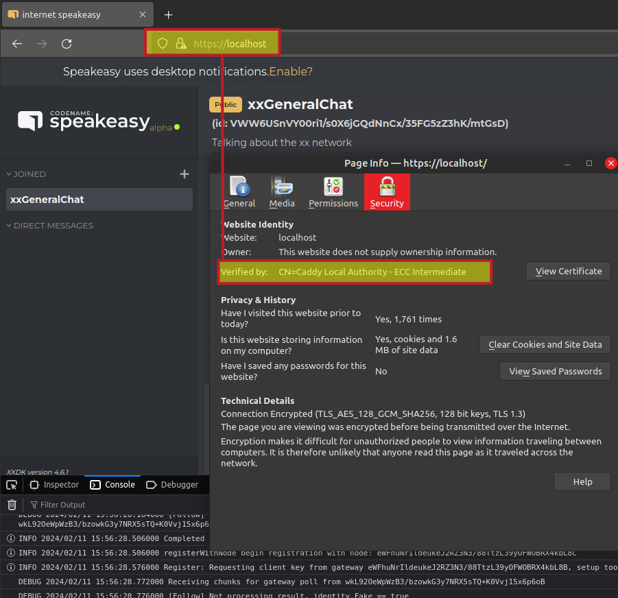
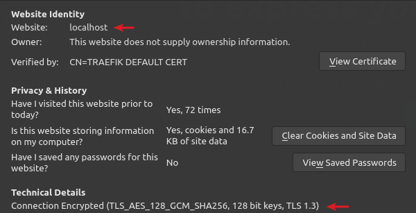

- [xx Network Haven (formerly Speakeasy) container image](#xx-network-haven-formerly-speakeasy-container-image)
  - [About Haven](#about-haven)
    - [Haven Web application](#haven-web-application)
  - [Quick start for Public IPs with Let's Encrypt](#quick-start-for-public-ips-with-lets-encrypt)
  - [Slow start](#slow-start)
    - [Run Haven from prebuilt image](#run-haven-from-prebuilt-image)
    - [Build and run own image](#build-and-run-own-image)
  - [Deploy a reverse HTTPS proxy](#deploy-a-reverse-https-proxy)
  - [Deploy with Docker Compose](#deploy-with-docker-compose)
    - [Public IP with FQDN](#public-ip-with-fqdn)
    - [Internal (LAN) IP with internal hostname or localhost](#internal-lan-ip-with-internal-hostname-or-localhost)
    - [Haven as Hidden Service on the Tor network](#haven-as-hidden-service-on-the-tor-network)
      - [Caddy](#caddy)
      - [Traefik](#traefik)
  - [Version and other container information](#version-and-other-container-information)
  - [License](#license)

# xx Network Haven (formerly Speakeasy) container image

**NOTE: one of the winning submissions from Hacktoberfest 2024 was an optimized Dockerfile for that you can find [here](https://github.com/xxfoundation/haven/blob/main/Dockerfile). Simply clone the repo and run `docker build .`.** 

## About Haven

[Haven](https://haven.xx.network) is a privacy-first Web client for xx Network.

It uses WASM and xxDK to access random gateways on the cMix network. It provides unique online identities, quantum-resistant encrypted messaging and other features. See the Web site for more.

### Haven Web application

A Web server is required to download Haven application code. The site that serves it - such as [https://haven.xx.network](https://haven.xx.network) - may collect client IP addresses (which merely identifies the address as a Haven user or, if compromised, even serve malicious code - unlikely, but not impossible, to happen on the official Haven site).

Haven Web server is not involved in forwarding or encrypting client data: that happens exclusively on the client (in browser).

Haven server running clean code cannot determine the content of messages or even who are the parties who exchange messages:

- Messages are not exchanged on the Haven Web server
- Messages are created, routed through xxNetwork's cMix protocol, and received directly on the Web client

Each user can use their own Haven server - it is not necessary to access the common server. The only tip regarding this is when you get a "join channel" link, you can optionally modify it to replace the FQDN with your own FQDN, although it should work without that step.

This Haven container makes it easier to:

- Run own Haven server
- Removes the risk of the server operator recording your IP address (which merely identifies you as a user, not your cMix identity)
- Removes the risk of malicious (modified or hacked) application code on the server
- Makes Haven Web app easily accessible from internal or external application portals

Some deployment scenarios:

- Small (1GiB RAM) cloud VM with Docker running Haven container, reverse-proxied by Cloudflare or another container (NGINX, Traefik, Caddy, etc.) on the same VM
- Haven and HTTPS proxy container on your desktop, notebook or home server
- Home-hosted Haven opened to friends or colleagues over Tailscale network

Reverse HTTPS proxy requires no Haven-specific steps: just forward HTTPS to whatever port Haven container is exposed at.

## Quick start for Public IPs with Let's Encrypt

For this you need a public IP address, DNS A record for FQDN.

```sh
git clone https://github.com/armchairancap/xx-haven-container
cd xx-haven-container
vi docker-compose.yml
```

- Create a DNS A record for your FQDN such as haven.something.io
- In `docker-compose.yml` replace YOUR@EMAIL.COM and YO.UR.TLD with your values
- For ARM64, change the Haven image URL from `ghcr.io/armchairancap/haven:latest` to `ghcr.io/armchairancap/haven-arm64:latest`. Currently I don't build multi-arch images on GHCR
- Open firewall ports tcp/80 (needed for Let's Encrypt) and tcp/443 to the world

```sh
docker compose up
```

Visit your site at https://FQDN.

Foreground mode (used below) can be exited with `CTRL+C`.

Once you get everything (including HTTPS reverse proxy) in order, you may add `-d` to `docker compose up` run Haven in the background.

## Slow start 

If you want to run a public instance, use Quick Start (above). 

If you want to run a private instance or build your own, read on.

### Run Haven from prebuilt image

It is recommended to build your own image from the official Dockerfile (as mentioned at the top). 

Use a service port available on your system and change the first 3000 to another port if you like. My pre-built image here may be out of date.

```sh
docker run -it --rm -p 0.0.0.0:3000:3000 --name haven ghcr.io/armchairancap/haven:latest npm run start
# use haven-arm64:latest for ARM64 hosts
```

That should start Haven container and expose its service at [http://localhost:3000](http://localhost:3000) (not *https*).

```sh
> haven-web@0.3.22 start
> next start 

ready - started server on 0.0.0.0:3000, url: http://localhost:3000
```

Don't click on that link because you may get nothing. Go to http://address:port from your Docker run command. Coincidentally it is the correct link because the example exposes Haven on the default NodeJS port (3000).

I this example the command exposed Haven on the port 8080:



If you're stuck, make sure your browser didn't redirect you to **https**:// instead, and that the port is correct.

Although you can now access Haven, you **still need a reverse HTTPS proxy in front of it** in order to use it! It won't work over HTTP.

### Build and run own image

You may need more than 2-3 GB of free disk space to build it.

The Haven source code repository has its own Dockerfile. Clone the source code, and run `docker build .` to build it. 

After cloning the repo, go to its directory and build.

```sh
git clone https://github.com/xxfoundation/haven/ && cd haven
docker build -t haven:latest .
docker run -it --rm -p 0.0.0.0:3000:3000 --name haven haven:latest npm run start
```

Now you should be able to see the Haven Web server's home page when you visit http://localhost:3000. You should still **use a reverse HTTPS proxy** in front of it in order to use it.

Once you get everything (including HTTPS reverse proxy) in order, you may add `-d` to `docker run` or `docker compose up haven` to run the container in the background.

## Deploy a reverse HTTPS proxy

Without HTTPS in front of Haven you will see the welcome page.

If you use HTTPS, remember to access the TLS port and from there forward to Haven (e.g. port 3000).

Some popular approaches:

- [Caddy HTTPS with Let's Encrypt](https://caddyserver.com/docs/automatic-https)
- [Cloudflare HTTPS with Let's Encrypt](https://developers.cloudflare.com/ssl/origin-configuration/ssl-modes)
- [Tailscale HTTPS with Let's Encrypt](https://tailscale.com/kb/1153/enabling-https)

## Deploy with Docker Compose

### Public IP with FQDN

To run a Haven container using image `haven:dev` exposed at `http://localhost:38080`:

```yaml
services:
  haven:
    image: haven:dev
    container_name: "haven"
    entrypoint: ["npm", "run", "start"]
    ports:
      - "38080:3000"
```

HTTPS reverse proxy with TLS that forwards `https://hostname:443` (or similar) to `http://localhost:38080` (or whatever you chose) is the last remaining step. 

What follows is the same thing as Quick Start (at the top), again using the default port 3000 to keep it consistent with other examples and Node .

Replace YOUR@EMAIL.COM and YO.UR.TLD with something that works for you.

```yaml
version: "3.3"
services:
  reverse-proxy:
    image: traefik:v2.11
    container_name: "traefik"
    command:
      - "--api.insecure=false"
      - "--api.dashboard=false"
      - "--api.debug=false"
      - "--providers.docker=true"
      - "--log.LEVEL=INFO"
      - "--entryPoints.web.address=:80"
      - "--entryPoints.websecure.address=:443"
      - "--providers.docker.exposedbydefault=false"
      - "--certificatesresolvers.myresolver.acme.httpchallenge=true"
      - "--certificatesresolvers.myresolver.acme.httpchallenge.entrypoint=web"
      - "--certificatesresolvers.myresolver.acme.email=YOUR@EMAIL.COM"
      - "--certificatesresolvers.myresolver.acme.storage=/letsencrypt/acme.json"
    ports:
      - "443:443"
      - "80:80"
      - "8080:8080"
    volumes:
      - "./letsencrypt:/letsencrypt"
      - "/var/run/docker.sock:/var/run/docker.sock:ro"
  node-server:
    image: ghcr.io/armchairancap/haven:latest
    # image: ghcr.io/armchairancap/haven-arm64:latest # use this for ARM64
    container_name: "node-server"
    labels:
      - "traefik.enable=true"
      - "traefik.http.routers.node-server.rule=Host(`YO.UR.TLD`)"
      - "traefik.http.routers.node-server.entrypoints=websecure"
      - "traefik.http.routers.node-server.tls.certresolver=myresolver"
      - "traefik.http.middlewares.redirect-to-https.redirectscheme.scheme=https"
      - "traefik.http.routers.redirs.rule=hostregexp(`{host:.+}`)"
      - "traefik.http.routers.redirs.entrypoints=web"
      - "traefik.http.routers.redirs.middlewares=redirect-to-https"
    entrypoint: ["npm", "run", "start"]
    ports:
      - "3000:3000"
```

- Your public (Internet) firewall must allow tcp/80 and tcp/443 to Traefik. tcp/8080 must not be open to Internet clients (that's Traefik admin port) and tcp/3080 either (HTTP address of Haven container).
- YO.UR.TLD must have a DNS A record for the Haven URL.
- Traefik will use its Let's Encrypt integration to automatically obtain a TLS certificate for YO.UR.TLD. Your TLS certificate will be stored in ./letsencrypt.
- Clients trying to access Haven at http://YO.UR.TLD will be redirected to https://YO.UR.TLD by Traefik, and from there Traefik will forward requests to http://node-server:3000 (Haven container).

Basic or other authentication can be added to limit access to authenticated users. See the Traefik v2 documentation for more.

Once you get everything (including HTTPS reverse proxy) in order, you may add `-d` to `docker compose up` run Haven in the background.

### Internal (LAN) IP with internal hostname or localhost

You can use localhost or some LAN host. For TLS (required) you need a CA-issued or self-signed TLS certificate with DNS resolution. You can use non-trusted, but you can also check the documentation for your OS on how to add this TLS to your OS and browser.

From the [Caddy documentation](https://caddyserver.com/docs/running#docker-compose), here's how we can use `docker compose cp` to copy Caddy CA-signed certificate to your Ubuntu host. See the link for the browser part.

```sh
# docker compose cp $CADDY_CONTAINER_NAME:/path/to/file
docker compose cp \
    reverse-proxy:/data/caddy/pki/authorities/local/root.crt \
    /usr/local/share/ca-certificates/root.crt \
  && sudo update-ca-certificates
```

Or you could create them using your existing CA and copy them to the container. Either way, that's out of scope so let's move on.

You may use docker-compose-localhost.yml and Caddyfile from the repo root for this:

```yaml
version: "3.3"
services:
  reverse-proxy:
    image: caddy
    container_name: "caddy"
    restart: unless-stopped
    ports:
      - "443:443"
      - "80:80"
    volumes:
      - "./caddy_data:/data"
      - "./caddy_config:/config"
      - "./Caddyfile:/etc/caddy/Caddyfile"
  haven-web:
    image: ghcr.io/armchairancap/haven:latest
    # image: ghcr.io/armchairancap/haven-arm64:latest # use this for ARM64
    container_name: "node-server"
    entrypoint: ["npm", "run", "start"]
    ports:
      - "3000:3000"
```

Caddyfile from this repository's root directory:

```raw
https://localhost {
    reverse_proxy haven-web:3000
}
```

This Caddy example will make Haven accessible from `https://localhost` (Caddy proxy).

```sh
docker-compose -f docker-compose-localhost.yml up
```

You may see something like this:



As the TLS certificate is signed by a Caddy CA generated on the fly, it will show as insecure unless you import both the Caddy CA file(s) and the certificate to make them trusted. See the Caddy documentation and community information for more. You don't *need* a valid & trusted TLS certificate for localhost, but on LAN hosts it would be better to have one.

Once you get everything (including HTTPS reverse proxy) in order, you may add `-d` to the Docker command to run in the background.

To use Traefik with self-issued TLS on localhost, simply replace the haven-web FQDN with `localhost`.



### Haven as Hidden Service on the Tor network

Remember that Tor Browser cannot use Haven because WASM isn't built in. *If* you're thinking about using Tor Browser with Haven, also forget about it. But you can use Haven on from a WASM-enabled browser connected to the Tor network through a Socks5 proxy, for example.

Also, Haven needs to be accessed over HTTPS, which is unrelated to .onion services.

If you want to hide that you're using Haven on your Haven server, you also need to ensure your browser's DNS requests are hidden and server's traffic is disabled.

If you want to minimize clearnet traffic from your server, don't use [OCSP stapling](https://caddyserver.com/docs/caddyfile/options#ocsp-stapling), use `local_certs`, etc. But if you serve Haven on both clearnet and Tor, that's possible but also complicated.

For .onion domains we'd likely use a self-signed CA and a self-signed host TLS certificate.

Maybe a self-generated TLS could contain some data that would prove it was created by a trusted person, but otherwise there's no difference between using HTTPS with a self-signed TLS certificate and HTTPS on Tor.

Since TLS on Tor doesn't make sense (we just need it for Haven), consider enabling `HiddenServiceNonAnonymousMode` which reduces anonymity of your server but improves its performance.

#### Caddy

You could reuse the example for LAN, just change Caddyfile to bind all interfaces including your .onion name, and do not open Internet or LAN firewall ports as access is allowed only through the Tor network. Caddyfile for a Tor Hidden Service would look similar to this:

```raw
https://127.0.0.1:443 {
  proxy haven-web:3000
}
```

In your Tor configuration file you may need to set HiddenServicePort (your.adddress.onion:443) to expose Caddy reverse proxy's service port. For example, with HTTPS we could have something like (Tor) HiddenServicePort 443 => (Caddy as Tor Hidden service) 127.0.0.1:443 => (Haven) haven-web:3000.

```raw
HiddenServiceVersion 3
HiddenServicePort 443 127.0.0.1:443
```

Find an example in `./tor` directory:

- Haven with Caddy reverse proxy (for local access)
- Separate Tor and NGINX containers configured to work on Tor and provide Hidden Service

#### Traefik

For Traefik you could try [this](https://traefik.io/blog/simplified-service-deployments-with-traefik-proxy-and-tor/). Again, that you need to add HTTPS to this configuration example and load own TLS certificates.

The guys at Tor have a [recipe](https://community.torproject.org/relay/setup/bridge/docker/) for containerized Tor relay (and here's their [.env](https://gitlab.torproject.org/tpo/anti-censorship/docker-obfs4-bridge/-/raw/main/.env) file) that preserves your Tor relay's identity (which may or may not be what you want). A more recent DIY recipe can be found [here](https://dev.to/nabarun/running-tor-proxy-with-docker-56n9). Alternatively, you can run Tor on the host.

## Version and other container information

Images tagged `:latest` are built from the upstream repository's `main` branch. Other images may be available as well - for example images built from the branch `dev` would be tagged `:dev`.

- x86_64: `haven:latest`
- ARM64 build: `haven-arm64:latest`

My Docker images get out of date, so it is recommended to build your own version (which comes from [here](https://github.com/xxfoundation/haven/)) for safest production use.

The upstream repository may have some vulnerabilities but Haven executes on the client and it is served as read-only from the server, so the risk of NPM package vulnerabilities should be very low - especially if you host your own instance.

## License

- For Speakeasy / Haven, please refer to upstream license
- This repo uses the MIT License
